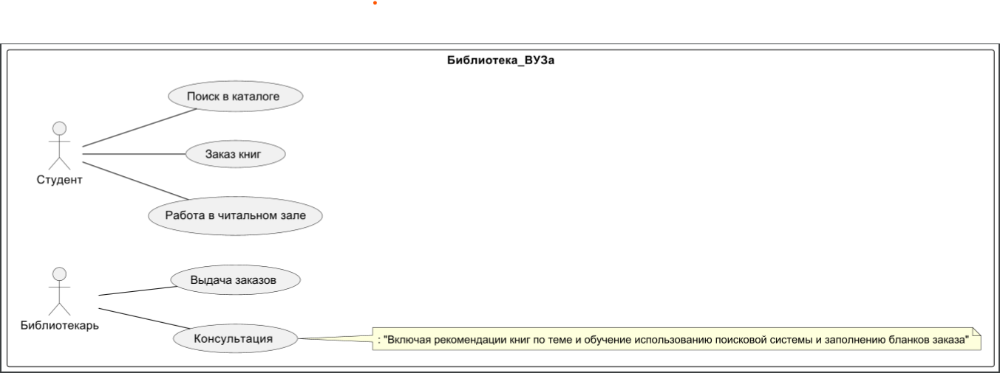

# Практика 0

Построил простейшую диаграмму на примере библиотеке. Отношение студент и библиотекаль

Диаграмма:



```()
@startuml "Практическая работа 0"
left to right direction
rectangle Библиотека_ВУЗа {
Студент -- (Работа в читальном зале)
Студент -- (Заказ книг)
Студент -- (Поиск в каталоге)
Библиотекарь -- (Консультация)
Библиотекарь -- (Выдача заказов)
note right of (Консультация):: "Включая рекомендации книг по теме и обучение использованию поисковой системы и заполнению бланков заказа"

}
@enduml
```
