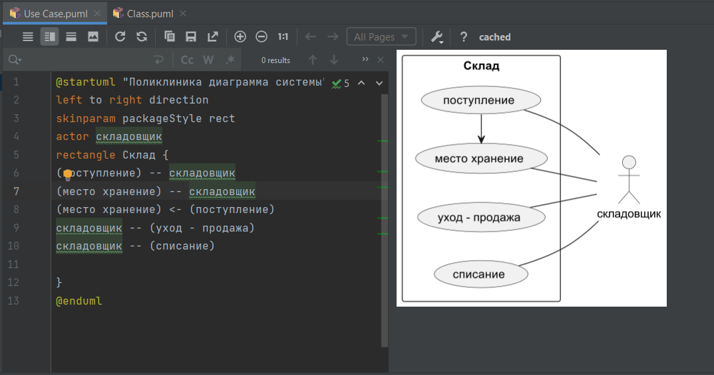
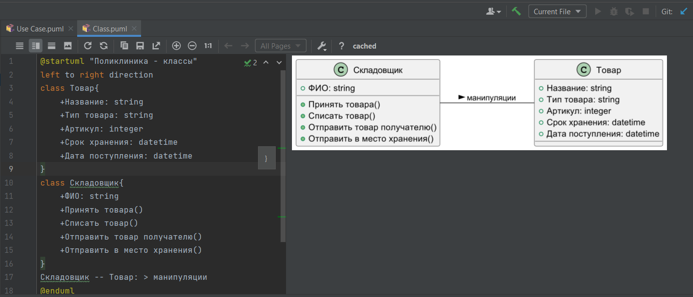

# Практическая 1

## Вариант 6

Информационная система склада

Обзор: информационная система склада позволяет учитывать поступление, уход и списание товаров со склада, а также определять место хранения товаров на складе.

1 Диаграмма использования:  

2 Диаграмма классов:

## Контрольные вопросы

1 Что такое UML? Какие вы знаете основные диаграммы UML?

UML - унифицированный язык моделирования.

Основные диаграммы:
•диаграмма прецедентов;
•диаграмма классов;
•диаграмма объектов;
•диаграмма последовательностей;
•диаграмма взаимодействия;
•диаграмма состояний;
•диаграмма активности;
•диаграмма развертывания.

2 Какие элементы входят в состав диаграммы классов?
Основными элементами являются классы и связи между ними. Классы характеризуются при помощи атрибутов и операций.
Атрибуты описывают свойства объектов класса. Большинство объектов в классе получают свою индивидуальность из-за различий в их атрибутах и взаимосвязи с другими объектами. Однако, возможны объекты с идентичными значениями атрибутов и взаимосвязей. Т.е. индивидуальность объектов определяется самим фактом их существования, а не различиями в их свойствах. Имя атрибута должно быть уникально в пределах класса. За именем атрибута может следовать его тип и значение по умолчанию.
Операция есть функция или преобразование. Операция может иметь параметры и возвращать значения.
