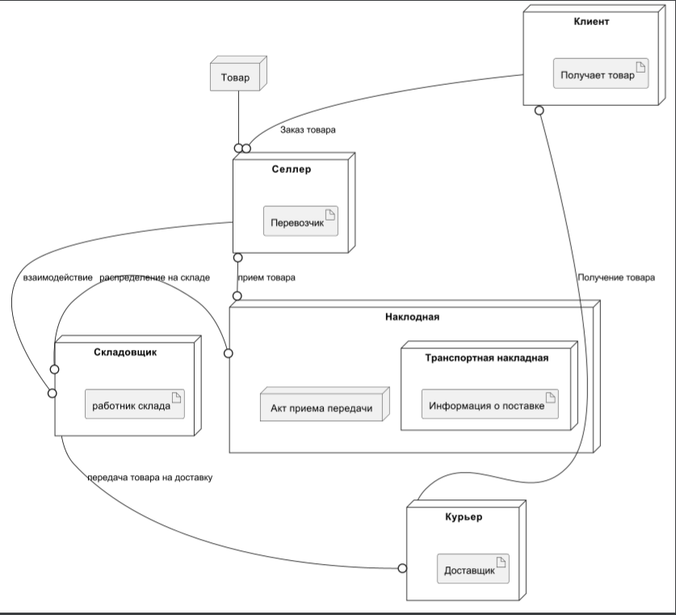
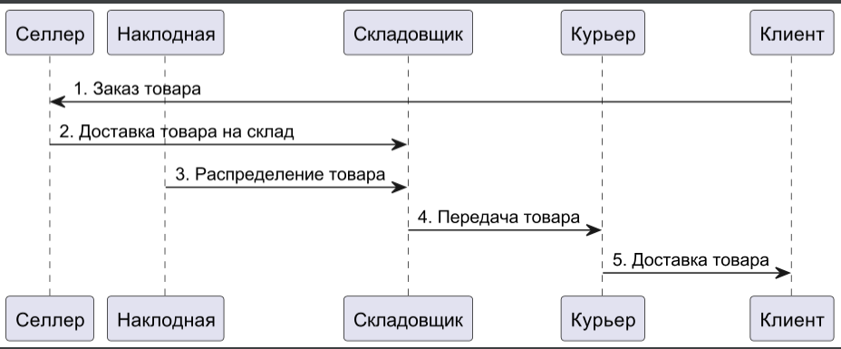

# Практическая 2

## Вариант 6

1.Диаграмма развертывания:
@startuml "Диаграмма развёртывания"
top to bottom direction
node Курьер{
        artifact "Доставщик"
        }
node Селлер{
       artifact "Перевозчик"
       }
node Товар{
}

node Складовщик{
    artifact "работник склада"
}
node Клиент{
    artifact "Получает товар"
    }
Селлер 0--0 Наклодная: прием товара
Наклодная 0--0 Складовщик: распределение на складе
node Наклодная{
node "Транспортная накладная" {
    artifact "Информация о поставке"
}
node "Акт приема передачи"{
}
}
Селлер --0 Складовщик: взаимодействие
Товар --0 Селлер
Складовщик --0 Курьер: передача товара на доставку
Курьер --0 Клиент: Получение товара
Клиент --0 Селлер: Заказ товара
@enduml

2.Диаграмма последовательности:

@startuml "Диаграмма последовательности"
participant Селлер
participant Наклодная
participant Складовщик
participant Курьер
participant Клиент

Клиент -> Селлер: 1. Заказ товара
Селлер -> Складовщик: 2. Доставка товара на склад
Наклодная -> Складовщик: 3. Распределение товара
Складовщик -> Курьер: 4. Передача товара
Курьер -> Клиент: 5. Доставка товара
@enduml

