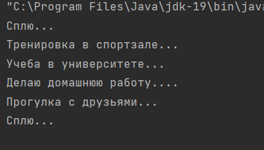

#Практика 3

##Стратегия

Создаем интерфейс Activity:

```()

package Strategy;

public interface Activity {
    public void justDoIt();
}

```

Создаем класс Student:

```()

package Strategy;

public class Student {
    Activity activity;
    public void setActivity(Activity activity) {
        this.activity = activity;
    }
    public void executeActivity() {
        activity.justDoIt();
    }
}

```

Создаем класс Sleeping:

```()

package Strategy;

public class Sleeping implements Activity {
    @Override
    public void justDoIt(){
        System.out.println("Сплю...");
    }
}

```

Создаем класс Doing_Homework:

```()

package Strategy;

public class Doing_Homework implements Activity {
    @Override
    public void justDoIt(){
        System.out.println("Делаю домашнюю работу....");
    }
}

```

Создаем класс Studying_at_the_University:

```()

package Strategy;

public class Studying_at_the_University implements Activity{
    @Override
    public void justDoIt(){
        System.out.println("Учеба в университете...");
    }
}

```

Создаем класс Training:

```()

package Strategy;

public class Training implements Activity {
    @Override
    public void justDoIt(){
        System.out.println("Тренировка в спортзале...");
    }
}

```

Создаем класс Walk:

```()

package Strategy;

public class Walk implements Activity{
    @Override
    public void justDoIt(){
        System.out.println("Прогулка с друзьями...");
    }
}

```

Создаем класс StudentRunner:

```()

package Strategy;

public class StudentRunner {
    public static void main(String[] args) {
        Student student = new Student();

        student.setActivity(new Sleeping());
        student.executeActivity();

        student.setActivity(new Training());
        student.executeActivity();

        student.setActivity(new Studying_at_the_University());
        student.executeActivity();

        student.setActivity(new Doing_Homework());
        student.executeActivity();

        student.setActivity(new Walk());
        student.executeActivity();

        student.setActivity(new Sleeping());
        student.executeActivity();
    }
}

```

Результат работы программы:


Диаграмма:

```()

@startuml
class Strategy.Student {
~ Activity activity
+ void setActivity(Activity)
+ void executeActivity()
}
class Strategy.Training {
+ void justDoIt()
}
interface Strategy.Activity {
+ void justDoIt()
}
class Strategy.StudentRunner {
+ {static} void main(String[])
}
class Strategy.Doing_Homework {
+ void justDoIt()
}
class Strategy.Studying_at_the_University {
+ void justDoIt()
}
class Strategy.Walk {
+ void justDoIt()
}
class Strategy.Sleeping {
+ void justDoIt()
}


Strategy.Activity <|.. Strategy.Training
Strategy.Activity <|.. Strategy.Doing_Homework
Strategy.Activity <|.. Strategy.Studying_at_the_University
Strategy.Activity <|.. Strategy.Walk
Strategy.Activity <|.. Strategy.Sleeping
@enduml
```


##Шаблонный метод (Template Method)

Создаем класс WelcomePage:

```()
package Template_Method;

public class WelcomePage extends WebsiteTemplate{
    @Override
    public void showPageContent(){
        System.out.println("Добро пожаловать на сайт");
    }
}

```

Создаем класс NewsPage:

```()
package Template_Method;

public class NewsPage extends WebsiteTemplate {
    @Override
    public void showPageContent(){
        System.out.println("Новости");
    }
}

```

Создаем абстрактный класс WebsiteTemplate:

```()

package Template_Method;

public abstract class WebsiteTemplate {
    public void showPage() {
        System.out.println("Верхний колонтитул");
        showPageContent();
        System.out.println("Нижний колонтитул");
    }
    public abstract void showPageContent();

}

```

Создаем класс WebsiteRunner:

```()
package Template_Method;

public class WebsiteRunner {
    public static void main(String[] args) {
        WebsiteTemplate welcomePage = new WelcomePage();
        WebsiteTemplate newsPage = new NewsPage();

        welcomePage.showPage();

        System.out.println("====================");

        newsPage.showPage();

    }
}

```

Результат работы программы:


Диаграмма:

```()
@startuml
abstract class Template_Method.WebsiteTemplate {
+ void showPage()
+ {abstract}void showPageContent()
}
class Template_Method.WebsiteRunner {
+ {static} void main(String[])
}
class Template_Method.WelcomePage {
+ void showPageContent()
}
class Template_Method.NewsPage {
+ void showPageContent()
}


Template_Method.WebsiteTemplate <|-- Template_Method.WelcomePage
Template_Method.WebsiteTemplate <|-- Template_Method.NewsPage
@enduml
```

