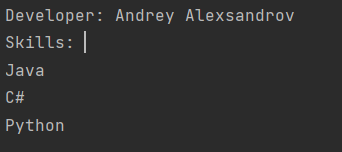
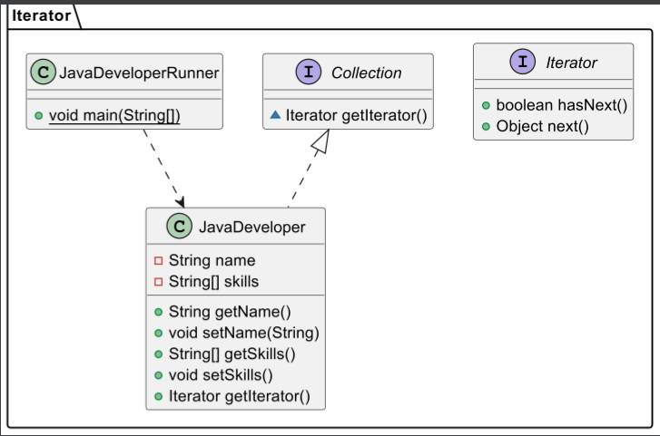
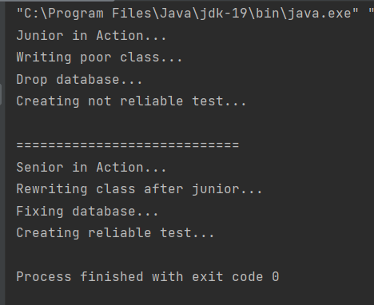
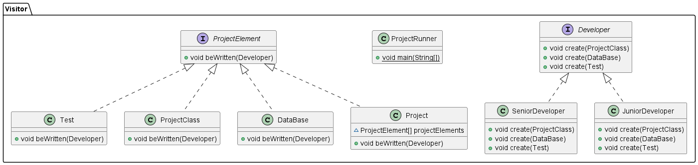

# Практика 4
## Итератор

Создаем интерфейс Iterator

```()
package Iterator;

public interface Iterator {
    public boolean hasNext();
    public Object next();
}
```

Создаем интерфейс Collection

```()
package Iterator;

public interface Collection {
    Iterator getIterator();
}
```

Создаем класс JavaDeveloper

```()
package Iterator;

public class JavaDeveloper implements  Collection{
    private String name;
    private String[] skills;

    public JavaDeveloper(String name, String[] skills){
        this.name = name;
        this.skills = skills;
    }
    public String getName() {
        return name;
    }
    public void setName(String name) {
        this.name = name;
    }
    public String[] getSkills() {
        return skills;
    }
    public void setSkills() {
        this.skills = skills;
    }

    @Override
    public Iterator getIterator() {
        return new SkillIterator();
    }

    public class SkillIterator implements Iterator{
        int index;
        @Override
        public boolean hasNext() {
            if(index<skills.length){
                return true;
            }
            return false;
        }
        @Override
        public  Object next() {
            return skills[index++];
        }
    }
}
```

Создаем класс JavaDeveloperRunner

```()
package Iterator;

public class JavaDeveloperRunner {
    public static void main(String[] args) {
        String[] skills = {"Java", "C#", "Python", };

        JavaDeveloper javaDeveloper = new JavaDeveloper("Andrey Alexsandrov", skills);

        Iterator iterator = javaDeveloper.getIterator();
        System.out.println("Developer: " + javaDeveloper.getName());
        System.out.println("Skills: ");

        while (iterator.hasNext()){
            System.out.println(iterator.next().toString() + " ");
        }
    }
}
```

Результат работы программы:


Диаграмма UML:


```()
@startuml
interface Iterator.Iterator {
+ boolean hasNext()
+ Object next()
}
interface Iterator.Collection {
~ Iterator getIterator()
}
class Iterator.JavaDeveloperRunner {
+ {static} void main(String[])
}
class Iterator.JavaDeveloper {
- String name
- String[] skills
+ String getName()
+ void setName(String)
+ String[] getSkills()
+ void setSkills()
+ Iterator getIterator()
}


Iterator.Collection <|.. Iterator.JavaDeveloper
Iterator.JavaDeveloperRunner ..> Iterator.JavaDeveloper

@enduml
```

##Посетитель

Создаем интерфейс ProjectElement

```()
package Visitor;

public interface ProjectElement {
    public void beWritten(Developer developer);
}
```

Создаем интерфейс Developer

```()
package Visitor;

public interface Developer {
    public void create(ProjectClass projectClass);
    public void create(DataBase dataBase);
    public void create(Test test);
}
```

Создаем класс Project

```()
package Visitor;

public class Project implements ProjectElement{
    ProjectElement[] projectElements;
    public Project() {
        this.projectElements = new ProjectElement[] {
                new ProjectClass(),
                new DataBase(),
                new Test()
        };

    }
    @Override
    public void beWritten(Developer developer) {
        for(ProjectElement element: projectElements) {
            element.beWritten(developer);
        }
    }
}
```

Создаем класс ProjectClass

```()
package Visitor;

public class ProjectClass implements ProjectElement{
    @Override
    public void beWritten(Developer developer){
        developer.create(this);
    }
}
```

Создаем класс Test

```()
package Visitor;

public class Test implements ProjectElement{
    public void beWritten(Developer developer) {
        developer.create(this);
    }
}
```

Создаем класс DataBase

```()
package Visitor;

public class DataBase implements ProjectElement{
    @Override
    public void beWritten(Developer developer) {
        developer.create(this);
    }

}
```

Создаем класс JunionDeveloper

```()
package Visitor;

public class JuniorDeveloper implements Developer{
    @Override
    public void create(ProjectClass projectClass) {
        System.out.println("Writing poor class...");
    }
    @Override
    public void create(DataBase dataBase) {
        System.out.println("Drop database...");
    }
    @Override
    public void create(Test test) {
        System.out.println("Creating not reliable test...");
    }
}
```

Создаем класс SeniorDeveloper

```()
package Visitor;

public class SeniorDeveloper implements Developer{
    @Override
    public void create(ProjectClass projectClass) {
        System.out.println("Rewriting class after junior...");
    }
    @Override
    public void create(DataBase dataBase) {
        System.out.println("Fixing database...");
    }
    @Override
    public void create(Test test) {
        System.out.println("Creating reliable test...");
    }

}
```

Создаем класс ProjectRunner

```()
package Visitor;

public class ProjectRunner {
    public static void main(String[] args) {
        Project project = new Project();

        Developer junior = new JuniorDeveloper();
        Developer senior = new SeniorDeveloper();

        System.out.println("Junior in Action...");
        project.beWritten(junior);

        System.out.println("\n============================");

        System.out.println("Senior in Action...");
        project.beWritten(senior);
    }
}
```

Результат работы программы:


Диаграмма UML:


```()
@startuml
interface Visitor.Developer {
+ void create(ProjectClass)
+ void create(DataBase)
+ void create(Test)
}
class Visitor.SeniorDeveloper {
+ void create(ProjectClass)
+ void create(DataBase)
+ void create(Test)
}
class Visitor.Test {
+ void beWritten(Developer)
}
class Visitor.JuniorDeveloper {
+ void create(ProjectClass)
+ void create(DataBase)
+ void create(Test)
}
class Visitor.ProjectClass {
+ void beWritten(Developer)
}
class Visitor.ProjectRunner {
+ {static} void main(String[])
}
interface Visitor.ProjectElement {
+ void beWritten(Developer)
}
class Visitor.DataBase {
+ void beWritten(Developer)
}
class Visitor.Project {
~ ProjectElement[] projectElements
+ void beWritten(Developer)
}


Visitor.Developer <|.. Visitor.SeniorDeveloper
Visitor.ProjectElement <|.. Visitor.Test
Visitor.Developer <|.. Visitor.JuniorDeveloper
Visitor.ProjectElement <|.. Visitor.ProjectClass
Visitor.ProjectElement <|.. Visitor.DataBase
Visitor.ProjectElement <|.. Visitor.Project
@enduml
```
