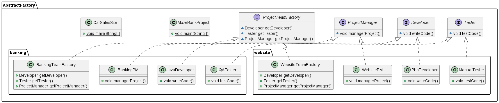
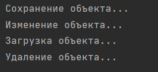

# Практика 5

## Абстрактная фабрика (abstract factory)

1. Создаем интерфейс Developer

```()
package AbstractFactory;

public interface Developer {
    void writeCode();
}
```

2. Создаем интерфейс Tester

```()
package AbstractFactory;

public interface Tester {
    void testCode();
}
```

3. Создаем интерфейс ProjectManager

```()
package AbstractFactory;

public interface ProjectManager {
    void managerProject();
}
```

4. Создаем интерфейс ProjectTeamFactory

```()
package AbstractFactory;

public interface ProjectTeamFactory {
    Developer getDeveloper();
    Tester getTester();
    ProjectManager getProjectManager();

}
```

5. Создаем package banking (система интернет банкинга)
5.1 Создаем класс JavaDeveloper

```()
package AbstractFactory.banking;

import AbstractFactory.Developer;

public class JavaDeveloper implements Developer {
    @Override
    public void writeCode(){
        System.out.println("Java разработчик пишет код для системы интернет банкинга...");
    }

}
```

5.2 Создаем класс QATester

```()
package AbstractFactory.banking;

import AbstractFactory.Tester;

public class QATester implements Tester {
    @Override
    public void testCode(){
        System.out.println("QA тестер тестирует код системы интернет банкинга...");
    }
}
```

5.3 Создаем класс BankingPM

```()
package AbstractFactory.banking;

import AbstractFactory.ProjectManager;

public class BankingPM implements ProjectManager {
    @Override
    public void managerProject(){
        System.out.println("Banking PM управляет проектом системы интернет банкинга...");
    }
}
```

5.4 Создаем класс BankingTeamFactory

```()
package AbstractFactory.banking;

import AbstractFactory.Developer;
import AbstractFactory.ProjectManager;
import AbstractFactory.ProjectTeamFactory;
import AbstractFactory.Tester;

public class BankingTeamFactory implements ProjectTeamFactory {
    @Override
    public Developer getDeveloper() {
        return new JavaDeveloper();
    }
    @Override
    public Tester getTester(){
        return new QATester();
    }
    @Override
    public ProjectManager getProjectManager(){
        return new BankingPM();
    }

}
```

6. Создаем package website

6.1 Создаем класс PhpDeveloper

```()
package AbstractFactory.website;

import AbstractFactory.Developer;

public class PhpDeveloper implements Developer {
   @Override
   public void writeCode(){
       System.out.println("Php разработчик пишет php код...");
   }
}
```

6.2 Создаем класс ManualTester

```()
package AbstractFactory.website;

import AbstractFactory.Tester;

public class ManualTester implements Tester {
    @Override
    public void testCode(){
        System.out.println("Manual тестер тестирует веб-сайт...");
    }
}
```

6.3 Создаем класс WebsitePM

```()
package AbstractFactory.website;

import AbstractFactory.ProjectManager;

public class WebsitePM implements ProjectManager {
    @Override
    public void managerProject() {
        System.out.println("Website PM управляет проектом веб-сайта...");


    }
}
```

6.4 Создаем класс WebsiteTeamFactory

```()
package AbstractFactory.website;

import AbstractFactory.Developer;
import AbstractFactory.ProjectManager;
import AbstractFactory.ProjectTeamFactory;
import AbstractFactory.Tester;

public class WebsiteTeamFactory implements ProjectTeamFactory {
    @Override
    public Developer getDeveloper(){
        return new PhpDeveloper();
    }
    @Override
    public Tester getTester(){
        return new ManualTester();
    }
    @Override
    public ProjectManager getProjectManager(){
        return new WebsitePM();
    }

}
```

7. Создаем класс CarSalesSite

```()
package AbstractFactory;

import AbstractFactory.website.WebsiteTeamFactory;

public class CarSalesSite {
    public static void main(String[] args) {
        ProjectTeamFactory projectTeamFactory = new WebsiteTeamFactory();
        Developer developer = projectTeamFactory.getDeveloper();
        Tester tester = projectTeamFactory.getTester();
        ProjectManager projectManager = projectTeamFactory.getProjectManager();

        System.out.println("Создание веб-сайта по продаже автомобилей...");
        developer.writeCode();
        tester.testCode();
        projectManager.managerProject();

    }

}
```

8. Создаем класс MazeBankProject

```()
package AbstractFactory;

import AbstractFactory.banking.BankingTeamFactory;

public class MazeBankProject {
    public static void main(String[] args) {
        ProjectTeamFactory projectTeamFactory = new BankingTeamFactory();
        Developer developer = projectTeamFactory.getDeveloper();
        Tester tester = projectTeamFactory.getTester();
        ProjectManager projectManager = projectTeamFactory.getProjectManager();

        System.out.println("Создание системы интернет банкинга...");
        developer.writeCode();
        tester.testCode();
        projectManager.managerProject();

    }
}
```

Результат работы программы:


UML диаграмма:



```()
@startuml
interface AbstractFactory.Tester {
~ void testCode()
}
interface AbstractFactory.Developer {
~ void writeCode()
}
class AbstractFactory.banking.QATester {
+ void testCode()
}
class AbstractFactory.website.PhpDeveloper {
+ void writeCode()
}
class AbstractFactory.website.ManualTester {
+ void testCode()
}
class AbstractFactory.banking.BankingTeamFactory {
+ Developer getDeveloper()
+ Tester getTester()
+ ProjectManager getProjectManager()
}
interface AbstractFactory.ProjectManager {
~ void managerProject()
}
class AbstractFactory.banking.BankingPM {
+ void managerProject()
}
interface AbstractFactory.ProjectTeamFactory {
~ Developer getDeveloper()
~ Tester getTester()
~ ProjectManager getProjectManager()
}
class AbstractFactory.website.WebsiteTeamFactory {
+ Developer getDeveloper()
+ Tester getTester()
+ ProjectManager getProjectManager()
}
class AbstractFactory.MazeBankProject {
+ {static} void main(String[])
}
class AbstractFactory.banking.JavaDeveloper {
+ void writeCode()
}
class AbstractFactory.CarSalesSite {
+ {static} void main(String[])
}
class AbstractFactory.website.WebsitePM {
+ void managerProject()
}


AbstractFactory.Tester <|.. AbstractFactory.banking.QATester
AbstractFactory.Developer <|.. AbstractFactory.website.PhpDeveloper
AbstractFactory.Tester <|.. AbstractFactory.website.ManualTester
AbstractFactory.ProjectTeamFactory <|.. AbstractFactory.banking.BankingTeamFactory
AbstractFactory.ProjectManager <|.. AbstractFactory.banking.BankingPM
AbstractFactory.ProjectTeamFactory <|.. AbstractFactory.website.WebsiteTeamFactory
AbstractFactory.Developer <|.. AbstractFactory.banking.JavaDeveloper
AbstractFactory.ProjectManager <|.. AbstractFactory.website.WebsitePM
@enduml
```

### Строитель (builder)

1. Создаем класс Website

```()
package Builder;

public class Website {
    private String name;
    private Cms cms;
    private int price;

    public void setName(String name){
        this.name = name;
    }
    public void setCms(Cms cms){
        this.cms = cms;
    }
    public void setPrice(int price){
        this.price = price;
    }

    @Override
    public String toString() {
        return "Website{" +
                "name='" + name + '\'' +
                ", cms=" + cms +
                ", price=" + price +
                '}';
    }
}
```

2. Создаем перечисление Cms

```()
package Builder;

public enum Cms {
    WORDPRESS, ALIFRESCO;
}
```

3. Создаем абстрактный класс WebsiteBuilder

```()
package Builder;

public abstract class WebsiteBuilder {
    Website website;

    void  createWebsite(){
        website = new Website();
    }

    abstract void builderName();
    abstract void builderCms();
    abstract void builderPrice();

    Website getWebsite() {
        return website;
    }
}
```

4. Создаем класс Director

```()
package Builder;

public class Director {
    WebsiteBuilder builder;

    public void setBuilder(WebsiteBuilder builder) {
        this.builder = builder;
    }
    Website buildWebsite(){
        builder.createWebsite();
        builder.builderName();
        builder.builderCms();
        builder.builderPrice();

        Website website = builder.getWebsite();

        return website;
    }
}
```

5. Создаем класс EnterpriceWebsiteBuilder

```()
package Builder;

public class EnterpriseWebsiteBuilder extends WebsiteBuilder {
    @Override
    void builderName() {
        website.setName("Enterprise");
    }

    @Override
    void builderCms() {
        website.setCms(Cms.ALIFRESCO);
    }

    @Override
    void builderPrice() {
        website.setPrice(5000);
    }
}
```

6. Создаем класс VisitCardWebsiteBuilder

```()
package Builder;

public class VisitCardWebsiteBuilder extends WebsiteBuilder{
    @Override
    void builderName() {
        website.setName("Visit Card");
    }

    @Override
    void builderCms() {
        website.setCms(Cms.WORDPRESS);

    }

    @Override
    void builderPrice() {
        website.setPrice(500);

    }
}
```

7. Создаем класс BuilderWebsiteRunner 

```()
package Builder;

public class BuildWebsiteRunner {
    public static void main(String[] args) {
        Director director = new Director();

        director.setBuilder(new VisitCardWebsiteBuilder());
        Website website = director.buildWebsite();

        System.out.println(website);
    }
}
```

Результат работы программы:


Поменяем строчку

```()
director.setBuilder(new VisitCardWebsiteBuilder());
```

На новую:

```()
director.setBuilder(new EnterpriseWebsiteBuilder());
```

Вывод:


UML диаграмма:


#### Адаптер (adapter)

1. Создаем интерфейс Database

```()
package Adapter;

public interface Database {
    public void  insert();

    public void  update();

    public void  select();

    public void remove();
}
```

2. Создаем класс JavaApplication

```()
package Adapter;

public class JavaApplication {
    public void saveObject(){
        System.out.println("Сохранение объекта...");
    }
    public void updateObject(){
        System.out.println("Изменение объекта...");
    }
    public void loadObject(){
        System.out.println("Загрузка объекта...");
    }
    public void deleteObject(){
        System.out.println("Удаление объекта...");
    }
}
```

3. Создаем класс AdapterJavaToDatabase

```()
package Adapter;

public class AdapterJavaToDatabase extends JavaApplication implements Database{
    @Override
    public void insert() {
        saveObject();
    }

    @Override
    public void update() {
        updateObject();
    }

    @Override
    public void select() {
        loadObject();
    }

    @Override
    public void remove() {
        deleteObject();
    }
}
```

4. Создаем класс  DatabaseRunner

```()
package Adapter;

public class DatabaseRunner {
    public static void main(String[] args) {
        Database database = new AdapterJavaToDatabase();

        database.insert();
        database.update();
        database.select();
        database.remove();
    }
}
```

Результат работы программы:


UML диаграмма:


##### Посоредник (mediator)

1. Создаем интерфейс Chat

```()
package Mediator;

public interface Chat {
    public void sendMessage(String message, User user);

}
```

2. Создаем интерфейс User

```()
package Mediator;

public interface User {
    public void  sendMessage(String message);
    public void getMessage(String message);

}
```

3. Создаем класс Admin

```()
package Mediator;

public class Admin implements User{
    Chat chat;
    String name;

    public Admin(Chat chat, String name) {
        this.chat = chat;
        this.name = name;
    }

    public String getName() {
        return name;
    }

    public void setName(String name) {
        this.name = name;
    }

    @Override
    public void sendMessage(String message) {
        chat.sendMessage(message, this);
    }

    @Override
    public void getMessage(String message) {
        System.out.println(this.name + " получение сообщения: " + message + ".");
    }
}
```

4. Создаем класс SimpleUser

```()
package Mediator;

public class SimpleUser implements User{
    Chat chat;
    String name;

    public SimpleUser(Chat chat, String name) {
        this.chat = chat;
        this.name = name;
    }

    public String getName() {
        return name;
    }

    public void setName(String name) {
        this.name = name;
    }

    @Override
    public void sendMessage(String message) {
        chat.sendMessage(message, this);
    }

    @Override
    public void getMessage(String message) {
        System.out.println(this.name + " получение сообщения: " + message + ".");
    }
}
```

5. Создаем класс SimpleTextChat

```()
package Mediator;

import java.util.ArrayList;
import java.util.List;

public class SimpleTextChat implements Chat{
    User admin;
    List<User> users = new ArrayList<>();

    public void setAdmin(User admin) {
        this.admin = admin;
    }

    public void addUserToChat(User user){
        this.users.add(user);
    }

    @Override
    public void sendMessage(String message, User user) {
        for(User u: users){
            if(u!=user){
                u.getMessage(message);
            }
        }
        admin.getMessage(message);
    }
}
```

6. Создаем SimpleChatRunner

```()
package Mediator;

public class SimpleChatRunner {
    public static void main(String[] args) {
        SimpleTextChat chat = new SimpleTextChat();
        User admin = new Admin(chat, "Администратор");
        User user1 = new SimpleUser(chat, "Пользователь 1");
        User user2 = new SimpleUser(chat, "Пользователь 2");

        chat.setAdmin(admin);
        chat.addUserToChat(user1);
        chat.addUserToChat(user2);

        user1.sendMessage("Привет, я Пользователь 1");
        admin.sendMessage("Здравствуйте, я админ данного чата");

    }
}
```

Результат работы программы:


UML диаграмма:

