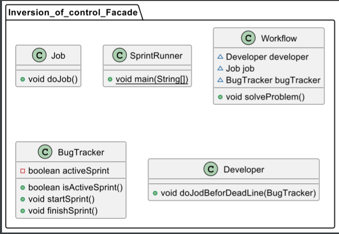

# Практика 6

## Заместитель (Proxy)

1. Создаем интерфейс Project

```()
package Proxy;

public interface Project {
    public void run();
}
```

2. Создаем класс RealProject

```()
package Proxy;

public class RealProject implements Project {
    private String url;

    public RealProject(String url) {
        this.url = url;
        load();
    }

    public void load(){
        System.out.println("Загрузка проекта с " + url + "..." );
    }
    @Override
    public void run() {
        System.out.println("Запуск проекта с " + url + "...");
    }

}
```

3. Создаем класс ProxyProject

```()
package Proxy;

public class ProxyProject implements  Project {
    private String url;
    private RealProject realProject;

    public ProxyProject(String url) {
        this.url = url;
    }

    @Override
    public void run(){
        if(realProject == null){
            realProject = new RealProject(url);
        }
        realProject.run();
    }
}
```

4. Создаем класс ProjectRunner

```()
package Proxy;

public class ProjectRunner {
    public static void main(String[] args) {
        Project project = new RealProject("https://github.com/alexsndrovandrey1/TMP");

        project.run();
    }
}
```

Вывод программы:


Диаграмма:


```()
@startuml
class Proxy.RealProject {
- String url
+ void load()
+ void run()
}
class Proxy.ProjectRunner {
+ {static} void main(String[])
}
interface Proxy.Project {
+ void run()
}
class Proxy.ProxyProject {
- String url
- RealProject realProject
+ void run()
}


Proxy.Project <|.. Proxy.RealProject
Proxy.Project <|.. Proxy.ProxyProject
@enduml
```

## Компоновщик (composite)

1. Создаем интерфейс Developer

```()
package Composite;

public interface Developer {
    public void writeCode();
}
```

2. Создаем клсс JavaDeveloper

```()
package Composite;

public class JavaDeveloper implements Developer {
    @Override
    public void writeCode() {
        System.out.println("Java разработчик пишет Java код...");
    }
}
```

3. Создаем класс PythonDeveloper

```()
package Composite;

public class PythonDeveloper implements Developer{
    @Override
    public void writeCode() {
        System.out.println("Python разработчик пишет Python код...");
    }
}
```

4. Создаем класс Team

```()
package Composite;

import java.util.ArrayList;
import java.util.List;

public class Team {
    private List<Developer> developers = new ArrayList<Developer>();
    public void  addDeveloper(Developer developer){
        developers.add(developer);
    }
    public void removeDeveloper(Developer developer){
        developers.remove(developer);
    }
    public void createProject(){
        System.out.println("Команда создала проект...\n");
        for(Developer developer: developers){
            developer.writeCode();
        }
    }
}
```

5. Создаем класс Project

```()
package Composite;

public class Project {
    public static void main(String[] args) {
        Team team = new Team();

        Developer firstJavaDeveloper = new JavaDeveloper();
        Developer secondJavaDeveloper = new JavaDeveloper();
        Developer PythonDeveloper = new PythonDeveloper();

        team.addDeveloper(firstJavaDeveloper);
        team.addDeveloper(secondJavaDeveloper);
        team.addDeveloper(PythonDeveloper);

        team.createProject();


    }
}
```

Вывод программы:


Диаграмма:


```()
@startuml
interface Composite.Developer {
+ void writeCode()
}
class Composite.Team {
- List<Developer> developers
+ void addDeveloper(Developer)
+ void removeDeveloper(Developer)
+ void createProject()
}
class Composite.PythonDeveloper {
+ void writeCode()
}
class Composite.JavaDeveloper {
+ void writeCode()
}
class Composite.Project {
+ {static} void main(String[])
}


Composite.Developer <|.. Composite.PythonDeveloper
Composite.Developer <|.. Composite.JavaDeveloper
@enduml
```

## Инверсия управление (IoC)

Для демонстрации инферсии управления использую шаблон фасад.

1. Создаем класс Job

```()
package Inversion_of_control_Facade;

public class Job {
    public void doJob(){
        System.out.println("Работа в процессе...");
    }
}
```

2. Создаем класс Developer

```()
package Inversion_of_control_Facade;

public class Developer {
    public void doJodBeforDeadLine(BugTracker bugTracker){
        if(bugTracker.isActiveSprint()){
            System.out.println("Разработчик решает проблемы...");
        } else {
            System.out.println("Разработчик читает документацию...");
        }
    }
}
```

3. Создаем класс BugTracker

```()
package Inversion_of_control_Facade;

public class BugTracker {
    private boolean activeSprint;

    public boolean isActiveSprint(){
        return activeSprint;
    }
    public void startSprint(){
        System.out.println("Sprint активен.");
        activeSprint = true;
    }
    public void finishSprint(){
        System.out.println("Sprint не активен.");
        activeSprint = false;
    }
}
```

4.  Создаем класс Workflow

```()
package Inversion_of_control_Facade;

public class Workflow {
    Developer developer = new Developer();
    Job job = new Job();
    BugTracker bugTracker = new BugTracker();

    public void solveProblem(){
        job.doJob();
        bugTracker.startSprint();
        developer.doJodBeforDeadLine(bugTracker);
    }
}
```

5. Создаем класс SprintRunner

```()
package Inversion_of_control_Facade;

public class SprintRunner {
    public static void main(String[] args) {
        Workflow workflow = new Workflow();

        workflow.solveProblem();
    }
}
```

Вывод программа:


Диаграмма:



```()
@startuml
class Inversion_of_control_Facade.Job {
+ void doJob()
}
class Inversion_of_control_Facade.SprintRunner {
+ {static} void main(String[])
}
class Inversion_of_control_Facade.Workflow {
~ Developer developer
~ Job job
~ BugTracker bugTracker
+ void solveProblem()
}
class Inversion_of_control_Facade.BugTracker {
- boolean activeSprint
+ boolean isActiveSprint()
+ void startSprint()
+ void finishSprint()
}
class Inversion_of_control_Facade.Developer {
+ void doJodBeforDeadLine(BugTracker)
}
@enduml
```
